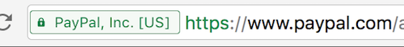

class: center, middle, inverse

# Let's go HTTPS-only!

### More Than Buying a Certificate

Steffen Gebert (@StGebert, first.last@typo3.org)

Available at https://github.com/StephenKing/t3cvie16-https

---
# Overview

* Intro

* Getting a Certificate

* Server Setup
  
* HTTP Headers

* Experience with https://typo3.org

---

class: center, middle, inverse
# Introduction

---

# What's this all about?

.large[Things that _you_ (or your colleague) can do to secure your / your client's users.

_Optionally:_ saves your / your client's butt / reputation, as it helps to prevent data leakage.]

---

# SSL vs. TLS

.left-column[
  
]
.right-column[

* We're always talking about the same thing, which is (nowadays) _TLS_.
 * (and the **S** in HTTP**S**, IMAP**S**, LDAP**S**, etc.)
  
* Older versions were called _SSL_
  * .red[insecure]/.green[secure]/.grey[draft] scoresheet:
  * .red[SSL 1.0, SSL 2.0, SSL 3.0], .green[TLS 1.0, TLS 1.1, TLS 1.2], .grey[TLS 1.3]

* It's the layer between TCP and the Application Layer protocol

  ```shell
  $ openssl s_client -connect typo3.org:443
  GET / HTTP/1.1
  Host: typo3.org
  
  HTTP/1.1 200 OK
  Server: nginx/1.9.9
  ...
  ```


* This gives us an encrypted connection (with a stranger aka. confidentiality/integrity)
]

---

# Whom Do We Trust?

* Peer is verified using the trust chain of _Certificate Authorities_ (CAs) signing the peer's certificate.

* Our device/software vendor dictates this _CA bundle_ for us.
* Some hundreds certificate authorities are trusted (does not mean: _trustful_) by our OSs/UAs.
* If a web site uses a certificate signed by _any_ of these CAs, everything is fine™ .red.bold[*]

* This solves the _authenticity_ problem (we know, with whom we're talking)

.footnote[.red.bold[*] given expiration date hasn't passed, yet.]

---
class: center, middle, inverse
# Getting a Trusted Certificate

---
# Getting a Trusted Certificate

* Generate a key pair (.red[private key] + .green[public key (unsigned)])

* Generate a .green[_Certificate Signing Request_] (CSR)

* Send .green[CSR] to some CA (plus some .red[money])

* Validate domain ownership by receiving an email

* You get the .green[signed certificate] back

* You place the .red[private key] + .green[signed cert] on your web server

* So, what's wrong here?
  * .red[stupid manual process] (there's no API for that - as you do it once per 1/2/3 year(s))
  * .red[money]
  * .red[CAs have failed] (badly!)

---

# Let's Encrypt

* A free Certificate Authority ❤
  * Sponsored by Mozilla, EFF, and some others
  * SSL for the masses

* Cert lifetime of max. 90 days

* Yes, you have to automate that!
  * API/renewal protocol for certificates (_ACME_)
  * Official Python client, tens of third-party clients available

* Domain-Validation: Challenge is checked via
  * HTTP(S) (directory `.well-known/acme/` contains challenges)
  * DNS (TXT record with challenge needs to be set)

* Only usable for publicly reachable services (?)

---

# Extended Validation Certs (EV)

* Green bar with company name in your UA


* Personal/company validation
  * Expensive
  * Personal presence required

---

# Dedicated IP vs. SNI 

* older days: you need a dedicated IP for SSL
  * problem: it's too late to send the `Host:` header, once connected via TLS
  
* nowadays: there's Server Name Indication (SNI)
  * informs server about targeted virtual host during TLS handshake
  * server picks key corresponding to that host name


---

class: center, middle, inverse
# Server Configuration & Validation

---

# TLS Proxy?


* I find it convenient 

* Number of options available
  * Apache httpd, nginx, haproxy
  * Varnish Software's _Hitch_ - anybody tried already?

---

# TLS Proxy?


* I find it convenient 

* Number of options available
  * Apache httpd, nginx, haproxy
  * Varnish Software's _Hitch_ - anybody tried already?


---
# Server Configuration

* Will not go into detail here, but used ciphers matter

* Use _Mozilla SSL Configuration Generator_.red.bold[*]


	.footnote[.red.bold[*] https://mozilla.github.io/server-side-tls/ssl-config-generator/]

---

# Validation

* QUALYS SSL Labs' SSL Checker:

	* The best thing ever! ❤❤❤
	* Get an A+!
      
    * https://www.ssllabs.com/ssltest/

* There's also a command line client (`ssllabs-scan`) and API clients
  * Include it in your CI (?!)
      

---

# Validation (cont'd)

* Supported TLS versions
* Insecure ciphers (RC4 etc.)
* Chain issues (missing / redundant certificates)
* TLS Vulnerabilities (BEAST, POODLE, Heartbleed & friends)
* (Strong) Forward Secrecy (Diffie Helman)
* Good HTTP headers as bonus (for the .green[A+])


---
class: center, middle, inverse

# Relevant HTTP Headers

---

# Relevant HTTP Headers

* OWASP provides _List of useful HTTP headers_ .red[*]
* Some are no-brainers (this slide), some are tough to implement

* Enforce XSS filter of browsers
  * `X-XSS-Protection: "1; mode=block"`
  
* Clickjacking protection
  * `X-Frame-Options:` 
  * **deny** - no rendering within a frame
  * **sameorigin** - no rendering if origin mismatch
  * **allow-from**: DOMAIN - allow rendering if framed by frame loaded from DOMAIN

* Disable MIME-type sniffing (browser might guess that a file is executable)
  * `X-Content-Type-Options: nosniff`


.footnote[.red.bold[*] Open Web Application Security Project, https://www.owasp.org/index.php/List_of_useful_HTTP_headers]

---
       

# HTTP Strict Transport Security (HSTS)

* Defines that UA must contact the server via HTTPS for all future requests (for 6 months)
  ```
  Strict-Transport-Security: "max-age=15768000; includeSubDomains"
  ```
* Why?
  * You follow a link to `http://example.com` through a public hotspot
  * Everybody sees your cookies.red[*]
  * MITM can redirect you to arbitrary sites
  * MITM can inject arbitrary code / drive-by downloads
* HSTS would prevent connecting via `http://` and automatically ugprade to secure connection.  

* Requirement: Site is reliably accessible via HTTPS
* Bonus / caveat: Most UAs will refuse to permit untrusted certificates

.footnote[.red.bold[*] Hopefully, cookie is set with `secure` option]

---

# Set-Cookie Options

* Cookie is sent to the UA using the `Set-Cookie: cookie_data` header

* `Set-Cookie: httponly` prevents JavaScript code to access the cookie (because XSS)

* `Set-Cookie: secure` prevents UA to send cookie data via plaintext (when HSTS is not used)

---

# Content Security Policies


* Specifies, which sources a browser is allowed to load
  * If policy is violated, UA will not load affected resource
  
* Defined via HTTP header
  * `Content-Security-Policy: script-src 'self'`
  * Allows only own domain as source for `<script>` tags
  
* Why?
  * XSS!
  
  ```
        Name: Steffen
        Comment:
          Hello, my name is Steffen and I want to include
          <script src="https://st-g.de/evil.js" />.
          Excecute?
  ```
  * It should not happen, but it does!

* Great intro: https://scotthelme.co.uk/content-security-policy-an-introduction/

---

# CSP: Options


* **default-src**: Define loading policy for all resources type in case of a resource type dedicated directive is not defined (fallback),
* **script-src**: Define which scripts the protected resource can execute,
* **object-src**: Define from where the protected resource can load plugins,
* **style-src**: Define which styles (CSS) the user applies to the protected resource,
* **img-src**: Define from where the protected resource can load images,
* **media-src**: Define from where the protected resource can load video and audio,
* **frame-src**: Define from where the protected resource can embed frames,
* **font-src**: Define from where the protected resource can load fonts,
* **connect-src**: Define which URIs the protected resource can load using script interfaces,
* **form-action**: Define which URIs can be used as the action of HTML form elements,
* **sandbox**: Specifies an HTML sandbox policy that the user agent applies to the protected resource,
* **script-nonce**: Define script execution by requiring the presence of the specified nonce on script elements,
* **plugin-types**: Define the set of plugins that can be invoked by the protected resource by limiting the types of resources that can be embedded,
* **reflected-xss**: Instructs a user agent to activate or deactivate any heuristics used to filter or block reflected cross-site scripting attacks, equivalent to the effects of the non-standard X-XSS-Protection header,
* **report-uri**: Specifies a URI to which the user agent sends reports about policy violation

---

# CSP: Report Mode

* CSP can kill your site
  * Test first!

* CSP allows to specify a report URI
  * Violations will be reported (not like with `sudo`) by browsers
  * Header `Content-Security-Policy`**`-Report-Only:`**
  
* What to use as Report URI?
  * https://report-uri.io, beautiful free service 

   ```
   Content-Security-Policy-Report-Only: default-src https:;
   	report-uri https://<your-account>.report-uri.io/r/default/csp/reportOnly
   ```

---
# report-uri.io


https://report-uri.io/account/reports/csp/

---

# CSP: Bonus

* allows to identify _mixed content_

* `upgrade-insecure-requests` allows to automatically load _mixed content_ via HTTPS

---

# CSP and TYPO3


* probably a tough job

* test on typo3.org:

   ```
   Content-Security-Policy-Report-Only:
     script-src 'self' 'unsafe-inline' 'unsafe-eval'
       https://piwik.typo3.org https://maps.google.com
       https://*.googleapis.com https://cdn.jquerytools.org;
     style-src 'self' 'unsafe-inline'
       https://fonts.googleapis.com;
     report-uri https://typo3org.report-uri.io/r/default/csp/reportOnly  
   ```

* you want to get rid of
  * `'unsafe-inline'`: allows inline JS
  * `'unsafe-eval'`: allows JS `eval()`

* you want to whitelist hashes of external resources

---

# HTTP Public Key Pinning (HKPK) 

* Overrides trust relationship of CAs delivered with OS/UA.

* Restricts (_"pins"_) the certificate accepted when connecting via TLS to specified fingerprints.

    ```
    Public-Key-Pins: pin-sha256="cUPcTAZWKaASuY...oBAkE3h2+soZS7sWs=";
                     pin-sha256="M8HztCzM3elUxk...";
                     max-age=5184000;
                     includeSubDomains"
    ```

* Again, there is `Public-Key-Pins`**`-Report-Only`**:
	* again, http://report-uri.io supports us here
	
* Two hashes:
  * currently used key pair
  * backup key pair (_key_ matters, doesn't have to be signed)

* Backup key is successor after current key

* Warning: Don't screw it up

---
class: center, middle, inverse
what happened with
# https://typo3.org
(few personal experiences)

---


# Clients

* few human users
* many machines
  * PHP
  * PHP with cURL
  * `curl`
  * `wget
  * on new systems
  * on old systems
  * on _very_ old systems

* hopefully, your site is visited by more humans

---

class: middle, center

# Redirects

(from HTTP to HTTPS)

were no issue!

---
class: middle, center

# PHP on Windows

does not trust any CA

you have to manually download CA bundle

---

# Don't kill all at once..

* IPv6 first (poor man's blue-green deployment)

* _wget_ on Debian 7 doesn't respect _subjectAltNames_

* Because sh*t happens (in parallel)


---

class: middle, center

# While you're at it..

Enable HTTP/2!

---
class: center, middle

# Summary

.large[Enforce encrypted connections!]
<br>It makes a better world.

.large[Use the available tools!]
<br>They help to validate your setup.

.large[Set security-relevant headers!]
<br> on web server or in application
<br>(only CSP & HPKP are hard to implement)

---
class: center, middle, inverse

# Thanks!
